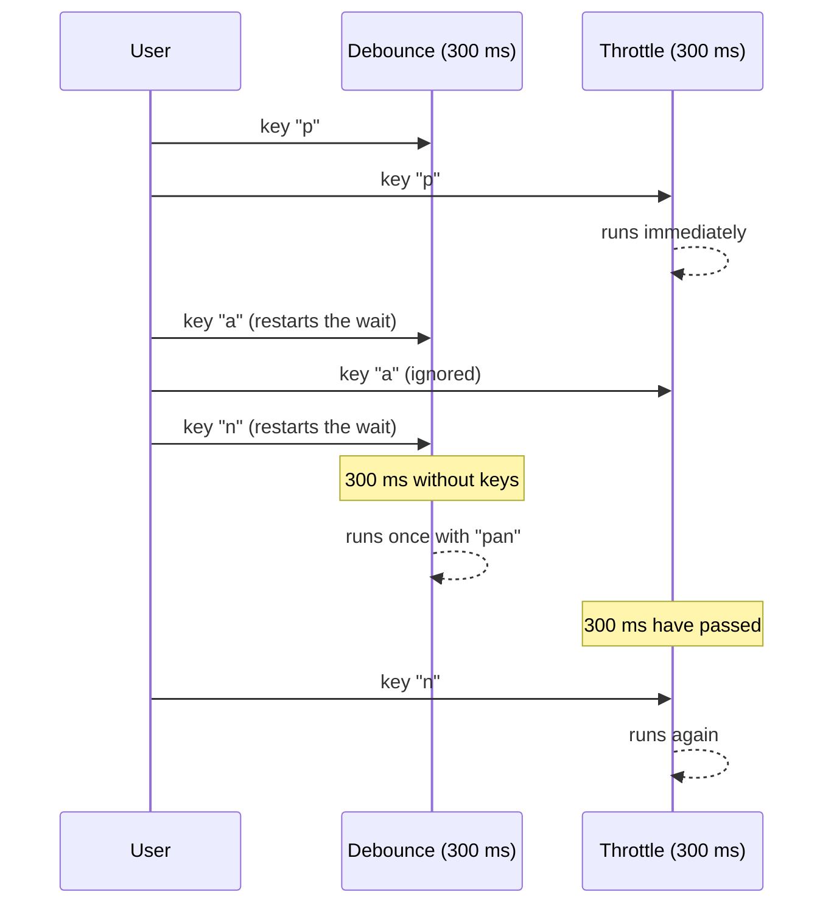

# Debounce and throttle

> [!REMEMBER]
> **Debounce** waits until you stop. **Throttle** lets you through, but at most once every N ms.

Typing in a search box, scrolling or resizing the window fire dozens of events per second. If each one triggers a request or an expensive computation, the app crawls. Both techniques filter that burst, in different ways.

## How they behave



| vs | Debounce | Throttle |
|---|---|---|
| Runs | Once, when the burst ends | At most once every N ms during the burst |
| Feels like | "I'll wait until you're done" | "I'll follow you, at my own pace" |
| Great for | Search boxes, validating a field while typing, autosave | Scroll, `resize`, dragging, tracking the mouse |
| Risk | If you never stop, it never runs | You may lose the last value unless you also run at the end |

> [!WHEN]
> Only care about the **final result**? Debounce. Need **continuous feedback** that stays cheap? Throttle.

## Minimal implementation

<!-- tabs -->
```ts title="debounce.ts"
export function debounce<A extends unknown[]>(fn: (...args: A) => void, ms: number) {
  let timer: ReturnType<typeof setTimeout> | undefined;
  return (...args: A) => {
    clearTimeout(timer);                       // every call cancels the previous one
    timer = setTimeout(() => fn(...args), ms); // and restarts the countdown
  };
}
```

```ts title="throttle.ts"
export function throttle<A extends unknown[]>(fn: (...args: A) => void, ms: number) {
  let last = 0;
  return (...args: A) => {
    const now = Date.now();
    if (now - last < ms) return; // too soon: ignored
    last = now;
    fn(...args);
  };
}
```
<!-- /tabs -->

## In React: a debounced search box

```steps
- title: Keep what the user types in normal state
  detail: The input still responds instantly; only the search is delayed.
- title: Derive a debounced value with a hook
  file: src/hooks/useDebouncedValue.ts
  detail: It updates 300 ms after the last keystroke.
- title: Fire the request when the debounced value changes, not the raw one
  file: src/features/search/SearchBox.tsx
```

```tsx title="useDebouncedValue.ts"
import { useEffect, useState } from "react";

export function useDebouncedValue<T>(value: T, ms = 300): T {
  const [debounced, setDebounced] = useState(value);
  useEffect(() => {
    const id = setTimeout(() => setDebounced(value), ms);
    return () => clearTimeout(id); // cancelled if value changes first
  }, [value, ms]);
  return debounced;
}
```

> [!CAUTION]
> If you call `debounce(fn)` directly in a component body, every render creates a new timer and the debounce stops working. Create it with `useMemo`/`useRef`, or use the hook above.

Related: [[event-loop]] · [[cancel-requests-with-abortcontroller]]
