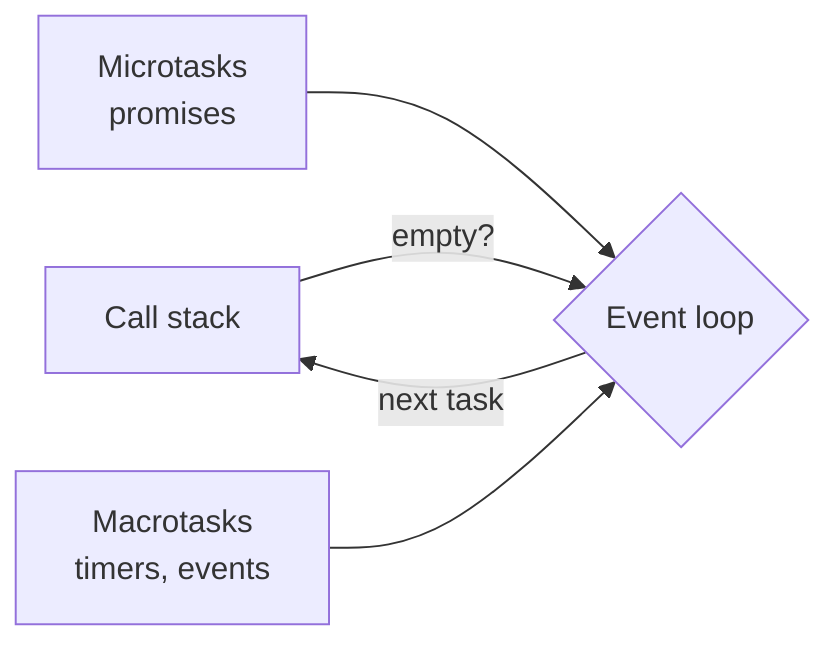

# The event loop

> [!REMEMBER]
> JavaScript has **one call stack**. Async work waits in a queue, and the loop moves it onto the stack **only when the stack is empty**.



```steps
- title: Run the current script until the stack is empty
- title: Drain every microtask (promise callbacks, `queueMicrotask`)
  detail: Microtasks always go first, even if a timer is already due.
- title: Let the browser paint if needed
- title: Take one macrotask (timer, click, network event) and repeat
```

```ts title="order.ts"
console.log("1 sync");
setTimeout(() => console.log("4 macrotask"), 0);
Promise.resolve().then(() => console.log("3 microtask"));
console.log("2 sync");
// 1 sync, 2 sync, 3 microtask, 4 macrotask
```

> [!CAUTION]
> A long synchronous loop blocks everything: no clicks, no painting, no timers. Split heavy work into chunks or move it to a Web Worker.

Related: [[debounce-and-throttle]]
