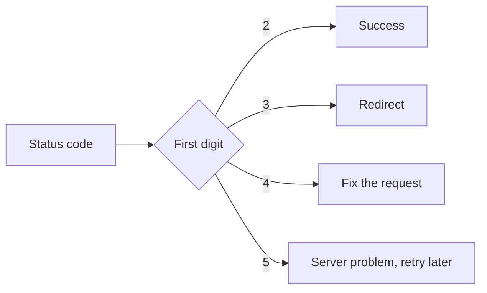

# HTTP status codes cheat sheet

> [!REMEMBER]
> The first digit tells the story: **2** worked, **3** go elsewhere, **4** your request is wrong, **5** the server failed.

## The ones you will see most

| Code | Name | Meaning |
|---|---|---|
| 200 | OK | It worked and here is the data |
| 201 | Created | A new thing was created |
| 204 | No Content | It worked, nothing to send back |
| 301 | Moved Permanently | Use the new URL from now on |
| 304 | Not Modified | Your cached copy is still good |
| 400 | Bad Request | The request is malformed |
| 401 | Unauthorized | You are not logged in |
| 403 | Forbidden | You are logged in but not allowed |
| 404 | Not Found | Nothing lives at this URL |
| 429 | Too Many Requests | Slow down |
| 500 | Internal Server Error | The server crashed |
| 503 | Service Unavailable | The server is down or overloaded |

## Which side is at fault?

> [!WHEN]
> Check this when a request "fails" and you need to decide between fixing your code (4xx) and waiting or retrying (5xx).
