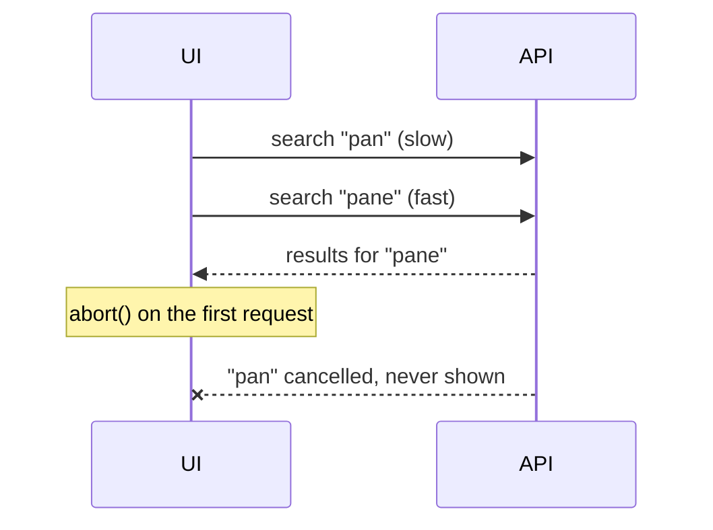

# Cancel requests with AbortController

> [!REMEMBER]
> Every new search should **abort the previous request**. Otherwise a slow old response can arrive last and win.



```steps
- title: Create one AbortController per request
  file: src/features/search/useSearch.ts
- title: Pass `controller.signal` to `fetch`
- title: Abort it in the effect cleanup
  detail: React runs the cleanup before the next effect, so the old request dies exactly when a new one starts.
- title: Ignore the `AbortError`
  detail: It is expected, not a failure.
```

```ts title="useSearch.ts"
useEffect(() => {
  const controller = new AbortController();
  fetch(`/api/recipes?q=${encodeURIComponent(query)}`, { signal: controller.signal })
    .then((res) => res.json())
    .then(setResults)
    .catch((err) => {
      if (err.name !== "AbortError") setError(err);
    });
  return () => controller.abort();
}, [query]);
```

> [!TIP]
> Combine it with [[debounce-and-throttle]]: debounce reduces how many requests start, abort makes sure only the latest one counts.

Related: [[event-loop]]
